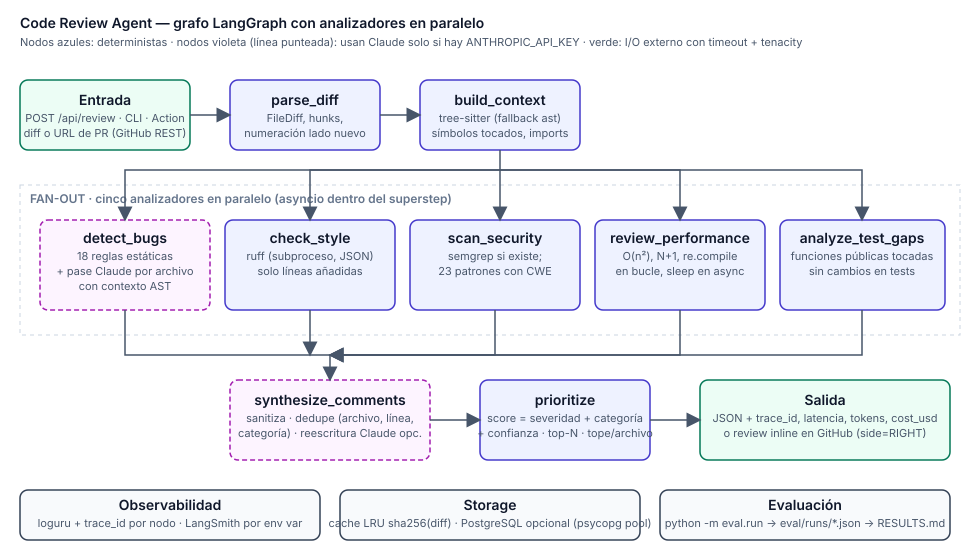

# Code Review Agent

[](https://github.com/Juadsuarezsan/code-review-agent/actions/workflows/ci.yml)
[](LICENSE)
[](.python-version)
[](.github/workflows/ci.yml)
[-7c5cff.svg)](demo/index.html)

Agente de revisión de código que lee un pull request, lo analiza desde cinco ángulos en
paralelo (bugs, estilo, seguridad, rendimiento, cobertura de tests) y devuelve los
comentarios inline más importantes, con ubicación exacta, severidad, sugerencia y
justificación. Funciona sin llave de API (modo determinista, $0) y con
`claude-sonnet-4-5-20250929` cuando la hay.

> **Demo:** `demo/index.html` (visor de diff con comentarios inline y 7 casos
> pre-calculados). La publicación en una URL persistente (GitHub Pages) es un paso manual
> pendiente del autor.

## Qué hace este proyecto

Recibe el diff de un PR (o su URL en GitHub) y responde en menos de un segundo con una
lista corta de comentarios: "en `app/backup.py` línea 5, `os.system('tar czf ' + name)`
permite inyección de comandos; usa `subprocess.run([...])`". Cada comentario se ancla a
una línea añadida, así que puede publicarse directamente como review en GitHub. Un
filtro de prioridad evita saturar al desarrollador con ruido de estilo.

## Caso de uso industrial

Equipos con decenas de PRs diarios (fintech, SaaS B2B, plataformas internas) donde la
revisión humana es el cuello de botella. El agente hace la primera pasada: bloquea
credenciales hardcodeadas, `pickle` sobre datos externos o SQL con f-strings antes de
que un humano gaste tiempo, y señala funciones públicas sin tests. Es el mismo espacio
que ocupan GitHub Copilot code review, CodeRabbit, Codacy o Sourcegraph Cody; la
diferencia de este proyecto es que la parte determinista es auditable regla por regla y
la parte LLM es opcional y medida contra ella.

## Arquitectura



Grafo LangGraph: `parse_diff → build_context → {detect_bugs, check_style, scan_security,
review_performance, analyze_test_gaps} → synthesize_comments → prioritize`. Detalle en
[`docs/architecture.md`](docs/architecture.md).

| Componente | Implementación |
|---|---|
| Context Builder | `tree-sitter` + `tree-sitter-python` (tolerante a fragmentos); fallback `ast` tras un `Protocol` |
| Bug Detector | 18 reglas estáticas (incl. multilínea: `except: pass`, mutar lista mientras se itera) + pase Claude por archivo con contexto AST |
| Style Checker | `ruff` como subproceso (`--isolated`, JSON) sobre un snippet con numeración real |
| Security Scanner | `semgrep` si `SEMGREP_BIN` apunta a un binario; si no, 23 patrones anotados con CWE |
| Performance Reviewer | heurísticas con seguimiento de bucles: O(n²), N+1, `re.compile` en bucle, `time.sleep` en `async def`… |
| Test Gap Analyzer | funciones públicas tocadas (según AST) que ningún cambio de tests referencia |
| Comment Synthesizer | sanitización, dedupe por (archivo, línea, categoría), reescritura opcional con Claude |
| Priority Filter | score = severidad + categoría + confianza; top-N y tope por archivo |
| GitHub | REST con `httpx` (diff, archivos, `POST …/pulls/{n}/reviews` inline), probado con `respx` |
| API | FastAPI: 422 en entradas inválidas, `slowapi`, CORS por variable, `X-Trace-Id`, cache LRU, PostgreSQL opcional |
| Observabilidad | `loguru` con `trace_id`, log de entrada/salida por nodo, tokens y `cost_usd` por request, LangSmith por env var |

## Métricas y resultados

Tabla generada por `python -m eval.run` a partir de `eval/runs/2026-09-29-linter-only.json`
(copiada de [`eval/RESULTS.md`](eval/RESULTS.md)). Dataset: `data/eval/cases.jsonl`, **38 PRs
sintéticos escritos a mano** con 35 defectos plantados y 5 PRs limpios, declarados como
sintéticos. Criterio de match: mismo archivo, misma categoría, ±2 líneas.

| Sistema | Bug Recall | Bug Precision | Comment Quality | FP rate | Costo/PR |
|---|---|---|---|---|---|
| Linter only (reglas estáticas + ruff + patrones; fallback determinista, sin LLM) | 91.4% | 97.0% | pendiente (requiere ANTHROPIC_API_KEY) | 3.0% | $0 (sin LLM) |
| Claude single-pass | pendiente (requiere ANTHROPIC_API_KEY) | pendiente (requiere ANTHROPIC_API_KEY) | pendiente (requiere ANTHROPIC_API_KEY) | pendiente (requiere ANTHROPIC_API_KEY) | pendiente (requiere ANTHROPIC_API_KEY) |
| Pipeline completo (este) | pendiente (requiere ANTHROPIC_API_KEY) | pendiente (requiere ANTHROPIC_API_KEY) | pendiente (requiere ANTHROPIC_API_KEY) | pendiente (requiere ANTHROPIC_API_KEY) | pendiente (requiere ANTHROPIC_API_KEY) |

Los tres defectos que el baseline no detecta son semánticos (operador invertido, `return`
omitido, variable equivocada): están en el set precisamente para medir qué aporta el LLM.
Comment Quality se mide con la rúbrica LLM-as-judge de `src/eval/judge.py` (criterios
numerados con ejemplos). La corrida sobre los 300 issues de SWE-bench Lite requiere
acceso a huggingface.co y `ANTHROPIC_API_KEY`; el script de descarga y la extracción de
ground truth están listos y probados con mocks. Análisis de errores en
[`docs/error_analysis.md`](docs/error_analysis.md); costo vs calidad en
[`docs/cost_vs_quality.md`](docs/cost_vs_quality.md).

## Quickstart

```bash
git clone https://github.com/Juadsuarezsan/code-review-agent && cd code-review-agent
make install                      # venv + pip install -e ".[dev]"
make test lint                    # pytest (cobertura ≥ 70 %), ruff, black, mypy --strict
make eval                         # regenera eval/runs/*.json y eval/RESULTS.md (sin llave)
make run                          # API en http://localhost:8000 (abre demo/index.html)
```

Revisar un diff desde la terminal o un PR público:

```bash
git diff main | .venv/bin/python -m src.cli review --diff-file - --format markdown
.venv/bin/python -m src.cli review-pr --url https://github.com/owner/repo/pull/42
# con GITHUB_TOKEN y --post publica los comentarios inline; con ANTHROPIC_API_KEY activa Claude
```

Como GitHub Action (composite, `action.yml`):

```yaml
- uses: Juadsuarezsan/code-review-agent@claude/fase-a   # o una tag cuando exista release
  with:
    github-token: ${{ secrets.GITHUB_TOKEN }}
    anthropic-api-key: ${{ secrets.ANTHROPIC_API_KEY }}  # opcional: sin ella, modo linter-only
```

Variables en [`.env.example`](.env.example). `docker compose up --build` levanta API +
PostgreSQL (validación pendiente: el entorno de desarrollo no tiene demonio Docker).

## Decisiones técnicas

Resumen; criterios completos en [`docs/decisions.md`](docs/decisions.md).

1. **LangGraph con fan-out/fan-in real** en vez de `asyncio.gather` con excepciones
   silenciadas: cada nodo loguea entrada/salida y los errores del modelo quedan en
   `errors`, no desaparecen.
2. **SDK oficial `anthropic` + `tenacity`**: la dependencia fantasma `langchain_anthropic`
   se eliminó; los reintentos (3, backoff 1–10 s, solo errores transitorios) son
   explícitos y probados; modelo pinneado con fecha.
3. **tree-sitter con fallback `ast`**: un diff son fragmentos; tree-sitter devuelve las
   definiciones visibles aunque la función esté cortada.
4. **ruff como subproceso sobre un snippet con numeración real** y reglas F401/F821
   ignoradas: sin el archivo completo, "nombre no definido" es ruido.
5. **semgrep opcional detrás de un `Protocol`**: no es aceptable como dependencia base de
   una Action; el scanner de patrones con CWE cubre el 100 % de los casos de seguridad
   del eval set.
6. **httpx + respx para GitHub** en vez de PyGithub (síncrono, difícil de mockear).
7. **Eval set sintético con ground truth derivada de marcadores**: cero errores de conteo
   de líneas y verificación automática de que cada defecto está en una línea añadida.

## Limitaciones conocidas

- **Sin llave no hay semántica.** Los tres casos semánticos del eval set no se detectan
  en modo linter-only; es la mayor debilidad del baseline y la razón de existir del nodo
  Claude, cuya contribución aún no está medida (requiere `ANTHROPIC_API_KEY`).
- **Solo Python en profundidad.** tree-sitter, ruff y las heurísticas cubren Python;
  JS/TS solo reciben reglas triviales.
- **Contexto limitado al diff.** No se clona el repositorio: los archivos relacionados
  se detectan solo si están en el mismo PR; F401/F821 se ignoran por eso.
- **Eval set sintético y pequeño** (38 PRs): las cifras son una cota, no un benchmark
  público. SWE-bench Lite está preparado pero no ejecutado.
- **Un pipeline por worker.** `ReviewPipeline` guarda las métricas del request en curso;
  para concurrencia intra-proceso se debe instanciar por request (barato).
- **Rate limit en memoria** (`slowapi`): no se comparte entre réplicas.

## Trabajo futuro

1. Corrida real: `make eval-full` con llave (single-pass, pipeline, juez) y SWE-bench Lite
   con `scripts/download_data.py`; ablation sin analizadores estáticos.
2. Checkout del repositorio para contexto completo (importadores, historia git, issue
   enlazado) y ruff/semgrep sobre archivos enteros.
3. Gramáticas tree-sitter para JS/TS y ESLint como segundo `StyleLinter`.
4. Prompt caching del system prompt y batching por lotes de archivos para reducir costo.
5. Galería de reviews sobre PRs públicos y publicación de la Action en el Marketplace
   (`v1.0.0` + release).

## Estructura

```
src/           parser/ context/ analyzers/ graph/ llm/ github/ storage/ api/ eval/ data/ cli.py
eval/          run.py · runs/*.json · RESULTS.md
data/eval/     cases.jsonl (sintético, declarado) · data/MANIFEST.txt
scripts/       build_eval_set.py · download_data.py · build_demo_predictions.py · build_notebook.py
docs/          architecture · decisions · scalability · performance · error_analysis · cost_vs_quality · data_schema · blog/
demo/          index.html + predictions.json (linter-only, declarado)
notebooks/     demo.ipynb (ejecutable sin llave)
action.yml     GitHub Action composite · .github/workflows/{ci,review-example}.yml
```

## Seguridad

`gitleaks detect --no-banner --redact` sin hallazgos (registrado en
`docs/performance.md`, sección "Verificaciones"); CI ejecuta `gitleaks/gitleaks-action@v2`.
Secretos solo por variables de entorno; `.env` en `.gitignore`.

## Autor

Juan David Suárez Sánchez · juadsuarezsan@unal.edu.co ·
[LinkedIn](https://www.linkedin.com/in/juan-david-suarez-sanchez-31ab281b7)

Licencia MIT ([`LICENSE`](LICENSE)).
